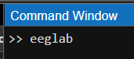
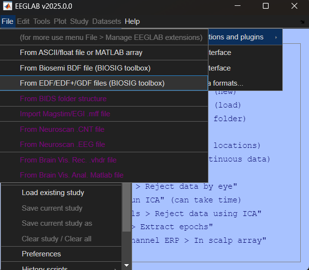
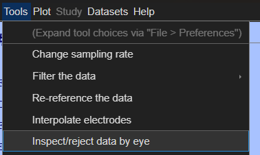
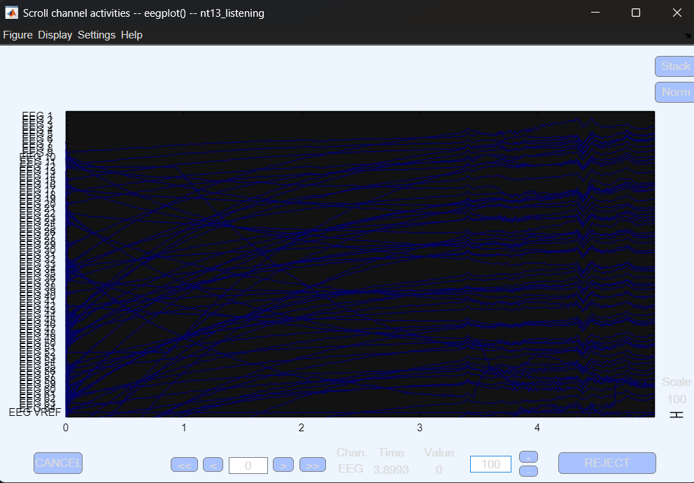
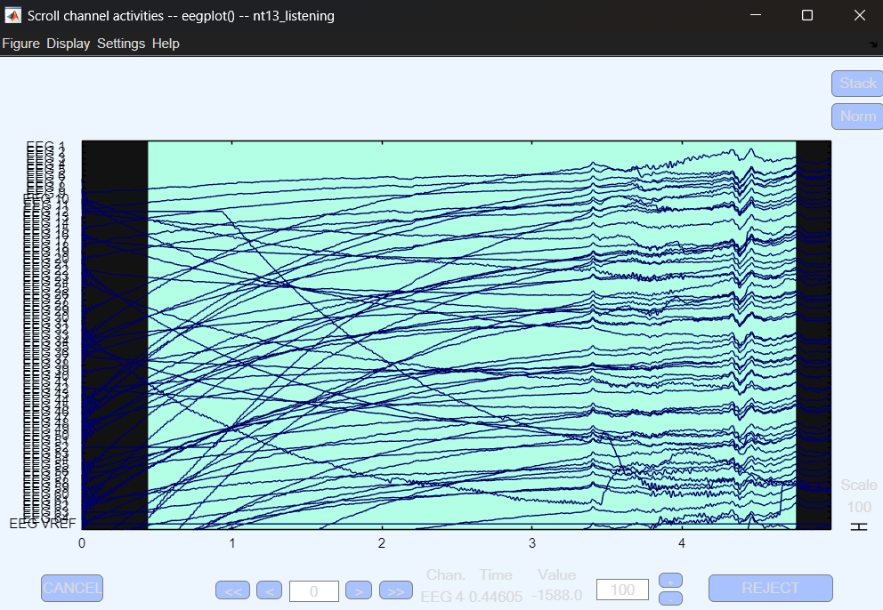
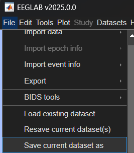
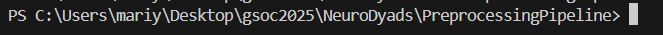
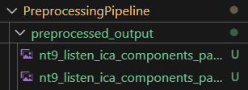
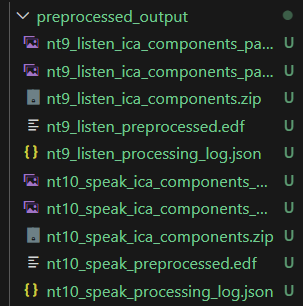

# EEG Preprocessing Pipeline Tutorial 

If you find any mistake or something is not clear write to M. Glushanina

## First part in MATLAB 

### Step 0: Install MATLAB and EEGLab 

[Link to EEGLab](https://sccn.ucsd.edu/eeglab/download.php)

### Step 1: Start EEGLab by writing eeglab in command line



### Step 2: Upload the file to EEGLab 

EDF format, default setup
Choose a name according to our naming convention, e.g. nt9_listening (neurotypical, part9, what do they do)



### Step 3: Inspect and reject data by eye 

Choose this option in the menu: 



Change the zoom to around 100-150 (near reject button): 



Select the part you want to remove with your mouse. Select ALL the parts you want to remove and only then press reject 



### Step 4: After removal don't forget to save the file 

You should choose this option: 



## Second part on your local machine 

### Step 1: Clone / download the repository from GitHub

Structure of the repository 

```
PreprocessingPipeline/
├── preprocessing/
│   ├── __init__.py
│   ├── rename_channels.py
│   ├── mutual_alignment.py
│   └── individual_preprocessing.py
├── requirements.txt # you need this 
├── utils/
│   ├── __init__.py
└── run_pipeline.py # and this 
```

### Step 2: In your terminal go to the repository 



### Step 3: Install all the necessary requirements 

To install all the requirements using pip: 

```
pip install -r requirements.txt 
```

### Step 4: Run the code on your local machine 

The structure of the code is 

```
python run_pipeline.py file1 file2 name1 name2 --montage montage_file 
```

For example (case of my local machine M. Glushanina): 
```
python run_pipeline.py C:/Users/mariy/Desktop/gsoc2025/used_files/n9_listen_cleaned_manually.set C:/Users/mariy/Desktop/gsoc2025/used_files/n10_speak_cleaned_manually.set  --name1 nt9_listen --name2 nt10_speak  --montage C:/Users/mariy/Desktop/gsoc2025/GSN-HydroCel-65_1.0.sfp
```

The two files in question should be people doing the task simultaneously, e.g. NT9 speaking and NT10 listening for the case of NT9-10 pair due to preprocessing pipeline 

If you want to change the output directory you should add: 

```
--output_dir directory_name
```

If you don't the script will automatically create one 

### Step 4.1: Beware of very noisy data 

If the data is too noisy, the algorithm will tell you. In this case mark the dataset is too noisy in our common spreadsheet 

### Step 5: Do everything the script asks you 

Meaning: 
1. Insert number of the components (for now it's 30)
2. You'll see plots popping up with ICA information. Close them, so the script could continue running 

You'll see the plots in the directory you chose as output directory: 



So you can look them up 

3. Enter ICA you wanted to exclude (comma-separated)

For example: 
```
1,2,3,4,5,6
```

EEGLab tutorial on artifact removal with ICA
[Tutorial](https://eeglab.org/tutorials/06_RejectArtifacts/RunICA.html)


4. Steps 1-3 will be repeated twice, once for each file you put into preprocessing 

5. You should see this kind of structure in the output directory: 



It should contain: .png files with ICA results, .zip file with this pics together, preprocessed .edf file and .json with all your decisions 
